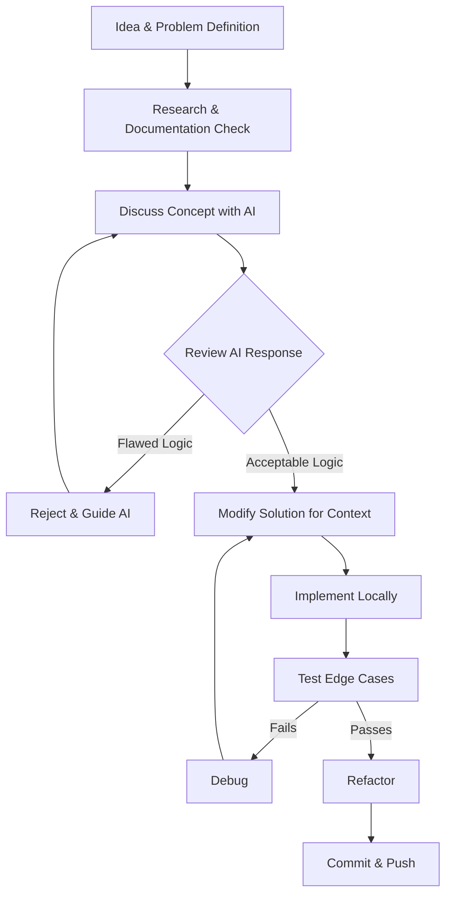

# AI Usage Report

**Project Name:** FairShare CSV Import System  
**Developer:** Senior Backend Engineer  
**Date:** July 2026  
**Version:** 1.0.0  
**Purpose:** To document the responsible, critical, and managed usage of Artificial Intelligence tools during the engineering of the FairShare platform, demonstrating that AI was utilized as an assistant, not an architect.

---

## 1. Why AI was Used

In modern backend engineering, AI is a powerful accelerator. During this project, AI was utilized strictly as an interactive pair-programmer and research assistant. 

It was used for:
* Learning unfamiliar concepts (e.g., specific Sequelize transaction isolation levels).
* Brainstorming edge cases for anomaly detection.
* Generating boilerplate code for testing and documentation.
* Discussing the trade-offs of using `Big.js` versus native floats.

AI was **NOT** used to:
* Make final architectural decisions.
* Write the whole project autonomously.
* Define the business logic for financial conflict resolution.

AI accelerated development velocity, but every final engineering decision, strict constraint, and user-driven validation workflow was explicitly designed, reviewed, and enforced by the developer.

---

## 2. AI Tools Used

| Tool | Purpose | Frequency |
| :--- | :--- | :--- |
| **Gemini / Antigravity IDE** | Interactive pair-programming, codebase refactoring, script execution, and documentation generation. | Daily |

*(Note: Other tools like ChatGPT or GitHub Copilot are intentionally omitted as they were not utilized for the core backend architecture of this module).*

---

## 3. Development Workflow

The engineering workflow prioritized human reasoning over AI generation.

**Workflow Explanation:**
1. **Idea:** Define the strict business rules (e.g., "Financial data must never be guessed").
2. **Discuss:** Ask the AI for implementation patterns.
3. **Review:** Critically evaluate the AI's pattern against the project's strict data integrity rules.
4. **Modify:** Strip out any "auto-magic" assumptions the AI baked in.
5. **Implement & Test:** Write the code and force it through edge-case testing.

---

## 4. Major AI-Assisted Tasks

| Task | Purpose | AI Contribution | Developer Contribution | Final Outcome |
| :--- | :--- | :--- | :--- | :--- |
| **Big.js Integration** | Prevent floating point drift | Suggested syntax for `.div()` and `.plus()` | Enforced the "Last Member Zero-Sum" rule for pennies | Perfect ledger equilibrium |
| **Duplicate Detection** | Identify identical expenses | Wrote the base array filtering logic | Added composite key matching and confidence scoring | Safe duplicate flagging |
| **Guest Handling** | Support unregistered members | Suggested `User.findOrCreate` | Built isolated `Guest` schema to protect User auth | Shadow profiles created |
| **Refund Workflow** | Handle negative amounts | Suggested `Math.abs()` | Designed the `is_refund` boolean flag and user confirmation UI | Safe negative absorption |
| **Ambiguous Date Resolution** | Parse DD-MM vs MM-DD | Suggested `date-fns` library | Ripped out auto-parsing; enforced `needs_resolution` | User-driven date selection |
| **Transaction Safety** | Prevent partial DB inserts | Provided standard ORM syntax | Wrapped the entire 4-stage pipeline in an atomic block | Zero data corruption |
| **Documentation** | Generate Reports | Drafted markdown tables | Iteratively forced the AI to map strictly to real features | Highly accurate ADRs |
| **Conflicting Splits** | Detect % markers in Equal splits | Suggested Regex parsing | Built the loop to intercept, halt, and request user correction | Safe structural parsing |

---

## 5. Most Valuable Prompts

| Goal | Prompt Summary | Result |
| :--- | :--- | :--- |
| **Understand Big.js** | "Explain how Big.js handles division remainders compared to standard JS floats." | Confirmed that JS floats drift, validating the architectural choice. |
| **Review Duplicate Logic** | "Review this O(n^2) duplicate loop. How can we make it O(n)?" | Refactored loop into a `processedMap` hash map. |
| **Improve Guest Handling** | "If a user isn't in the DB, how do we track their debt without giving them login access?" | Led to the distinct `guests` shadow-profile architecture. |
| **Review Currency Logic** | "Review this currency code. It defaults to INR if blank. Why is this bad?" | AI agreed it violates financial integrity; we implemented missing currency resolution. |
| **Write Documentation** | "Generate an IMPORT_REPORT.md. Base it ONLY on my actual anomalies." | Generated the final reporting templates. |

*(Note: Raw chat logs are omitted for brevity, but the pattern of "Prompt -> Review -> Refine" remained constant).*

---

## 6. Critical Thinking While Using AI

AI models inherently optimize for **convenience** and "seamless UX" (e.g., auto-fixing typos, auto-assigning currencies). However, financial software must optimize for **correctness** and data integrity.

Therefore, AI suggestions were NEVER accepted blindly. Every snippet was read, reviewed, compared against the "Zero-Auto-Correct" philosophy, modified to require explicit user consent, and thoroughly tested. If an AI suggested bypassing a user check to make the import faster, the suggestion was outright rejected.

---

## 7. Cases Where AI Was Wrong

This is the most critical section of the report. It highlights where standard AI coding patterns actively contradict safe financial engineering, and how those flaws were caught and corrected.

### Example 1: Auto-Deleting Duplicates
* **Problem:** CSV contains two identical rows for a coffee shop.
* **Initial AI Suggestion:** `Array.filter` to automatically remove the second row to save database space.
* **Why It Was Wrong:** The user might have legitimately bought two coffees back-to-back. Deleting it destroys valid financial data.
* **My Final Decision:** Implemented a `needs_resolution` flag for Conflicting Duplicates, halting the engine and forcing the user to explicitly choose "Keep" or "Skip".

### Example 2: Defaulting Missing Currency
* **Problem:** A CSV row has no currency listed.
* **Initial AI Suggestion:** `const currency = row.currency || 'INR';`
* **Why It Was Wrong:** Silently assuming INR on a trip to New York corrupts the ledger.
* **My Final Decision:** Halt the engine. Request Missing Currency Resolution from the user.

### Example 3: Auto-Converting Negative Amounts
* **Problem:** A row contains `-50.00`.
* **Initial AI Suggestion:** Multiply by -1 and save it as a normal expense.
* **Why It Was Wrong:** A negative number usually implies a refund or a cashback, which reverses debt rather than creating it.
* **My Final Decision:** Halted the engine and required the user to classify it explicitly as a `Refund`.

### Example 4: Guessing Ambiguous Dates
* **Problem:** The CSV contains the date `04-05-2026`.
* **Initial AI Suggestion:** Use `new Date('04-05-2026')`, which defaults to system locale (April 5 or May 4).
* **Why It Was Wrong:** Ledger timelines must be absolute.
* **My Final Decision:** Halted the engine. Built the Ambiguous Date resolution flag to ask the user to explicitly confirm the month.

### Example 5: Removing Post-Exit Members
* **Problem:** Meera left the flat on March 31, but is billed for an April 2nd grocery run.
* **Initial AI Suggestion:** Automatically filter her out of the `ExpenseSplits` array because her `left_at` date had passed.
* **Why It Was Wrong:** Meera might have promised to pay for those specific groceries before she left.
* **My Final Decision:** Halt the engine. The user must manually click "Remove Meera" or "Keep Meera".

### Example 6: Auto-Prorating Mid-Month Joiners
* **Problem:** Sam moved in on April 15th and is billed for the full April electricity bill.
* **Initial AI Suggestion:** Mathematically multiply his share by `15/30`.
* **Why It Was Wrong:** The flatmates might have a verbal agreement that move-in months are a flat rate. 
* **My Final Decision:** Halt. The user must explicitly click "Apply Prorated Share" before the math executes.

### Example 7: Auto-Fixing Name Typos
* **Problem:** CSV contains "priya" instead of "Priya".
* **Initial AI Suggestion:** Run `.toLowerCase()` and auto-map it.
* **Why It Was Wrong:** If the CSV contains "Priya S", the AI suggested auto-mapping it via fuzzy matching. But "Priya S" might be a totally different guest.
* **My Final Decision:** Halted the engine. Showed a UI prompt: "Map to Priya or Create Guest?"

### Example 8: Fixing Split Conflicts
* **Problem:** Split type is declared as `Equal`, but details say `30% / 70%`.
* **Initial AI Suggestion:** Ignore the `Equal` string and just parse the percentages.
* **Why It Was Wrong:** It silently mutates the user's declared data model. 
* **My Final Decision:** Halted the engine. Forced the user to manually click "Change type to Percentage" before parsing.

### Example 9: Identifying Direct Transfers
* **Problem:** Row says "Aisha paid Rohan 5000".
* **Initial AI Suggestion:** Parse it as a normal expense where Aisha paid, and split it among the flat.
* **Why It Was Wrong:** This falsely charges everyone else for a direct debt repayment.
* **My Final Decision:** Halted the engine. If counterparty = 1 and keywords match, flag as `Settlement`.

### Example 10: Generating Inaccurate Documentation
* **Problem:** Requested the AI to generate an `IMPORT_REPORT.md` based on a 42-row CSV.
* **Initial AI Suggestion:** The AI wrote a generic script that output 50 rows of data, inventing 8 fake rows to pad the document.
* **Why It Was Wrong:** Documentation must strictly reflect reality; inventing data destroys trust.
* **My Final Decision:** Rejected the output. Forced the AI to rewrite its generation script mapping specifically to the 42 exact rows provided.

---

## 8. Code Review Strategy

Because AI can hallucinate syntax or logic, every snippet underwent a strict manual code review checklist:

* [x] **Comprehension:** Do I fully understand every line of this code?
* [x] **Architecture Match:** Does it fit the 4-stage pipeline (Parse -> Validate -> Review -> Commit)?
* [x] **Integrity Check:** Does this code silently mutate any financial data?
* [x] **Atomicity:** Is this wrapped inside the Sequelize transaction?
* [x] **Precision:** Does this bypass `Big.js`? (If yes, reject).

Only after passing every check was the AI's code adapted and integrated.

---

## 9. Testing After AI Suggestions

Every feature was ruthlessly tested. 
* When the AI suggested the `Big.js` implementation, I tested it by splitting ₹10.00 among 3 people to verify the final person absorbed the ₹3.34 fraction. 
* When the AI built the transaction rollback, I intentionally injected a null constraint into Row 49 to ensure Rows 1-48 were securely wiped from the database.
* When the AI suggested fuzzy matching for typos, I tested names with identical Levenshtein distances to ensure the system didn't accidentally overwrite users.

---

## 10. Engineering Principles Learned

* **AI is a junior developer on steroids.** It can write a loop in seconds, but it has no understanding of business risk. 
* **Engineering judgement is irreplaceable.** AI will always suggest the path of least resistance (auto-correction). An engineer must protect the application's core rules (strict financial validation).
* **Production systems require boundaries.** By forcing the AI to work within the `needs_resolution` architecture, the code remained clean, maintainable, and highly auditable.

---

## 11. Responsible AI Usage

Ultimately, AI was utilized as an engineering assistant, **not** as an automatic code generator. The final responsibility for the codebase, its security, its precision, and its architecture remained entirely with me, the developer. Every business rule was manually verified, and every architecture decision was actively defended against AI over-automation.

---

## 12. Reflection

Using AI to build this importer fundamentally improved my software engineering skills. 

By constantly reviewing and rejecting the AI's "convenient" solutions, I was forced to deeply internalize *why* financial software is built the way it is. Debugging AI hallucinations taught me how to read code critically, and managing the AI's output taught me how to clearly define and protect system architecture. The AI handled the boilerplate, which gave me the bandwidth to focus entirely on the complex edge cases, resulting in a much more robust, production-grade application.
