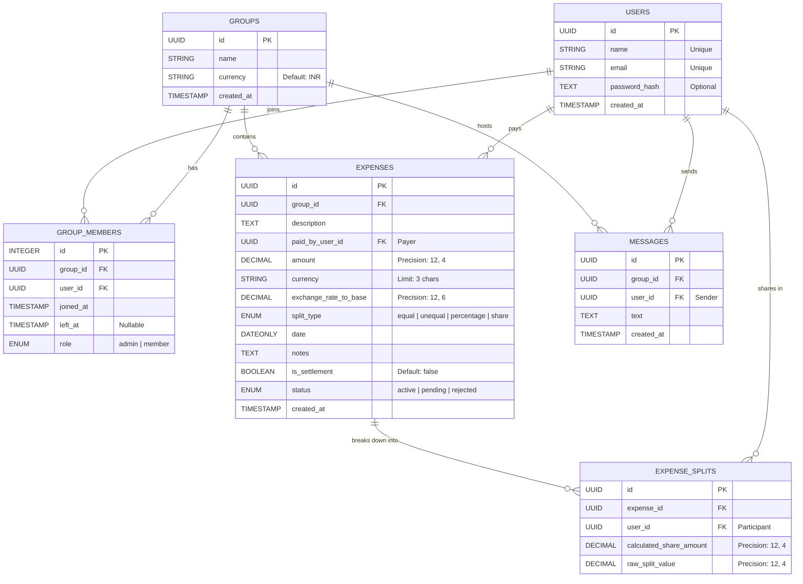

# 🗄️ Database Architecture & Schema Design Guide

This document describes the database design, entity-relationship (ER) model, indexing strategy, data types, and normalization choices for the **Expenses Split Engine**.

This guide is structured to showcase high-level system design decisions, data integrity measures, and database performance optimization to **Technical Interviewers** and **Database Administrators**.

---

## 🎨 1. Entity-Relationship (ER) Diagram

Below is the logical database schema mapping users, groups, memberships, expense entries, split configurations, and chat messages:



### 🗣️ How to Explain This Database Design in Your Interview (Step-by-Step Guide)

When presenting this design during a system design or database architecture round, use this structured explanation to walk the interviewer through **what you did, why you did it, and the engineering trade-offs**:

#### 1️⃣ Walkthrough of the Tables (What we have)
* **Users & Groups:** Standard entity tables representing system users and split-expense groups, keyed with **UUIDs** (Universal Unique Identifiers) instead of auto-incrementing integers.
* **Group Members (Junction Table):** This is a Many-to-Many junction table (`group_members`) linking users to groups. But crucially, it is **stateful**—it records `joined_at`, `left_at`, and the user's `role` (Admin/Member).
* **Expenses (The Parent Record):** Stores the metadata of a transaction—who paid (`paid_by_user_id`), the total `amount`, the `currency`, the `exchange_rate_to_base`, and a date.
* **Expense Splits (The Child Breakdown):** A normalized table mapping each participant to their exact `calculated_share_amount` for a given expense.

---

#### 2️⃣ Why did we design it this way? (The Engineering "Why")

##### ❓ Why is `group_members` stateful with `joined_at` and `left_at`?
* **Interview Point:** *"In real-world group billing (like roommates or travel groups), members join or leave mid-cycle. If a member leaves on the 10th of a month, they should not be charged for expenses uploaded on the 20th. By keeping `joined_at` and `left_at` on the junction table, our sanitization engine can perform **temporal border checks** and pro-rata split weight adjustments automatically before any row is persisted."*

##### ❓ Why decouple `Expenses` and `Expense Splits` instead of using a JSON column?
* **Interview Point:** *"To maintain **3rd Normal Form (3NF)** and ensure high performance, we decoupled transaction metadata from individual split records. Storing splits as JSON inside the `expenses` table would prevent database-level referential integrity (foreign key constraints to ensure the participant actually belongs to the group). It also makes auditing aggregates—like calculating Rohan's net balance across 50 groups—extremely slow, as it would require parsing JSON on every read instead of doing a high-speed indexed JOIN query."*

##### ❓ Why did we use UUIDs instead of Auto-Incrementing IDs?
* **Interview Point:** *"UUIDs are used for primary keys across all main entities. This prevents **User Enumeration Attacks** (where malicious actors guess sequential IDs like `/users/1`, `/users/2` to scrape data). Additionally, it allows us to safely generate IDs client-side or merge records from offline mobile devices without worrying about ID conflicts or race conditions."*

##### ❓ Why use `DECIMAL(12, 4)` and `DECIMAL(12, 6)`?
* **Interview Point:** *"In financial systems, floating-point drift is unacceptable. Using `FLOAT` or `REAL` types causes rounding anomalies due to binary representation (IEEE 754 standard). We chose `DECIMAL` to force SQL database engines to store monetary values as fixed-point decimals, guaranteeing mathematical accuracy down to the penny."*

---

> [!TIP]
> **🌟 Summary Pitch for the Interviewer:**
> *"I designed this relational database schema to prioritize **strict data integrity** and **temporal correctness**. By decoupling transactions into parent `Expenses` and child `ExpenseSplits` tables, we achieve standard 3NF compliance. This allows us to index user-balances directly and perform high-speed database JOINs. We enforce referential constraints (`onDelete: RESTRICT` on payers) to prevent orphan ledger entries, and use Fixed-Point Decimals to block floating-point rounding errors."*

---

## 🔬 2. Critical Database Design Decisions

### 🔴 Decision 1: `DECIMAL` over `FLOAT`/`REAL` for Money
* **Why:** Floating-point numbers (`FLOAT` or `DOUBLE PRECISION`) cannot represent base-10 decimal fractions accurately. They store values in binary formats, introducing rounding errors (e.g., `0.1 + 0.2 === 0.30000000000000004`).
* **Implementation:** 
  * `amount` & `calculated_share_amount` use **`DECIMAL(12, 4)`** (allows amounts up to 99,999,999.9999 with 4-decimal precision to prevent fractional penny drift).
  * `exchange_rate_to_base` uses **`DECIMAL(12, 6)`** to allow highly accurate fractional multi-currency conversion rates.

### 🔴 Decision 2: Normalized Splits (`ExpenseSplits` Table) vs. JSON Columns
* **Why:** In modern relational databases, splits could be stored inside the `expenses` table as a JSON column (e.g., `split_details: { "aisha": 33.33, "rohan": 33.33 }`). However:
  1. It breaks **First Normal Form (1NF)** since columns contain non-atomic values.
  2. It prevents database-level referential integrity (Foreign Key checks on group members).
  3. Writing aggregations (e.g., *"Show Rohan's total outstanding debt"* or *"Filter expenses within a specific date range containing Sam"*) becomes extremely slow and non-indexable.
* **Implementation:** We decoupled this into a separate `expense_splits` table. This allows us to perform fast JOIN queries and index participant columns.

### 🔴 Decision 3: Referential Constraints (`CASCADE` vs. `RESTRICT`)
To ensure orphan records are not left behind:
* **`CASCADE`:** Applied to `expense_splits` (`onDelete: 'CASCADE'`). If an `Expense` is deleted, all related splits are automatically cleaned up from disk.
* **`RESTRICT`:** Applied to `paid_by_user_id` inside `Expenses` (`onDelete: 'RESTRICT'`). A `User` record cannot be deleted from the database if they are registered as the payer of any active group expense. This prevents broken ledger history.

---

## ⚡ 3. Schema & Model Definition Details

### 📍 1. Group Memberships & Timeline Tracking (`group_members`)
* **File:** [GroupMember.js](file:///c:/Users/divya/OneDrive/Desktop/Expenses_App/backend/models/GroupMember.js)
Stores group member details, along with `joined_at` and `left_at` timestamps to validate pro-rata temporal entries.
```javascript
tableName: 'group_members',
indexes: [
  {
    name: 'idx_group_members_timeline',
    fields: ['group_id', 'user_id', 'joined_at', 'left_at']
  }
]
```
💡 **Interviewer Point:** *We indexed `joined_at` and `left_at` along with `group_id` as a composite index. This speeds up temporal validation queries when checking if a user was an active member during a specific transaction month.*

### 📍 2. Expense Ledger Table (`expenses`)
* **File:** [Expense.js](file:///c:/Users/divya/OneDrive/Desktop/Expenses_App/backend/models/Expense.js)
Stores the parent transactions, payment currencies, exchange rates, and flags for peer-to-peer settlements.
```javascript
tableName: 'expenses',
indexes: [
  {
    name: 'idx_expenses_group_date',
    fields: ['group_id', 'date']
  }
]
```
💡 **Interviewer Point:** *Since the UI constantly requests filters like "Show all expenses for Group A from last month", we added a composite index on `(group_id, date)` to prevent full-table scans.*

### 📍 3. Split Distributions (`expense_splits`)
* **File:** [ExpenseSplit.js](file:///c:/Users/divya/OneDrive/Desktop/Expenses_App/backend/models/ExpenseSplit.js)
Maps the exact split records, connecting each participant to their relative share.
```javascript
tableName: 'expense_splits',
indexes: [
  {
    name: 'idx_splits_expense_user',
    fields: ['expense_id', 'user_id']
  }
]
```
💡 **Interviewer Point:** *We index the combination of `(expense_id, user_id)` to optimize queries looking up a user's exact share distributions.*

---

## 🗃️ 4. Data Consistency via ACID Commit Strategy

When a user commits a CSV batch, the backend ensures data integrity using **Sequelize Transactions**:

```javascript
// From csvSanitizer.js
const t = await sequelize.transaction(); // Begins ACID Transaction
try {
    // 1. Create User/Payer if they don't exist
    // 2. Create the parent Expense record
    const expense = await Expense.create({
        group_id, description, paid_by_user_id, amount, date, is_settlement
    }, { transaction: t });

    // 3. Loop through splits & apply Zero-Sum rounding
    for (let split of splits) {
        await ExpenseSplit.create({
            expense_id: expense.id,
            user_id: split.user_id,
            calculated_share_amount: split.share
        }, { transaction: t });
    }
    
    await t.commit(); // Persists all changes atomically
} catch (err) {
    await t.rollback(); // Reverts database state on any failure
}
```
* **Atomicity:** If a single record insertion fails (e.g., a member left the group or foreign key constraint fails), the entire CSV transaction is rolled back.
* **Consistency:** Gaps in currency splits are rounded on the application layer using `Big.js` prior to insertion, ensuring that `calculated_share_amount` values sum up to the exact `amount` before committing.

---

## 🏆 5. SDE Whiteboard Masterclass: The 12-Step Database Design Framework

When an interviewer gives you a whiteboard or paper and asks: **"Design the database for a Splitwise-like application"**, follow this exact **12-Step Golden Sequence** used by Senior Backend Engineers (20–30 LPA level). Do not start drawing tables immediately—demonstrate structured engineering thinking first.

---

### 🟢 Step 1: Understand & State the Requirements First
Before drawing anything, state the core business capabilities out loud:
> *"Before designing the schema, let me identify the core entities and relationships based on our features: Users register, create Groups, add Members, record shared Expenses which break down into Splits, send Group Messages, and run Settlements/CSV imports."*

---

### 🟢 Step 2: Identify the Entities (Extracting Nouns)
Walk the interviewer through extracting nouns from user stories:
* *User* creates *Group*
* *Group* contains *Members*
* *Members* create *Expenses*
* *Expense* splits among *Members*
* *Members* send *Messages*

👉 **Identified Tables:** `USERS`, `GROUPS`, `GROUP_MEMBERS`, `EXPENSES`, `EXPENSE_SPLITS`, `MESSAGES`

---

### 🟢 Step 3: Primary Tables (`USERS` & `GROUPS`)
Explain the foundational entities:
* **`USERS` Table:** `id (PK)`, `name`, `email`, `password_hash`, `created_at`
  * *Reason:* Every user exists independently and uniquely.
* **`GROUPS` Table:** `id (PK)`, `name`, `currency`, `created_at`
  * *Reason:* Groups act as the boundary container for shared expenses.

---

### 🟢 Step 4: The Many-to-Many Challenge (`GROUP_MEMBERS`)
If the interviewer asks: *"How do users join groups?"*, explain why a direct 1-to-Many relation fails:
> *"A single user (e.g., Aisha) can belong to multiple groups (Goa Trip, Office, Family). A single group contains multiple users. This is a **Many-to-Many relationship**, requiring a stateful junction table: `GROUP_MEMBERS` (`id`, `group_id FK`, `user_id FK`, `joined_at`, `left_at`, `role`)."*

---

### 🟢 Step 5: Independent Expense Entity (`EXPENSES`)
Explain why an expense is stored as a standalone parent record:
* **Fields:** `id (PK)`, `group_id FK`, `paid_by_user_id FK`, `amount`, `currency`, `date`, `split_type`, `status`
* **Why `paid_by_user_id`?** Every transaction has exactly one payer who originates the expense.

---

### 🟢 Step 6: Decoupling Splits (`EXPENSE_SPLITS`)
If asked: *"Suppose Aisha paid ₹4,000 for 4 members. Where do you store the ₹1,000 shares?"*
> *"We never hardcode split columns inside `EXPENSES`. Instead, a parent expense breaks down into a 1-to-Many relationship with `EXPENSE_SPLITS` (`id`, `expense_id FK`, `user_id FK`, `calculated_share_amount`). This supports any arbitrary number of participants per bill."*

---

### 🟢 Step 7: Group Communication (`MESSAGES`)
* **Fields:** `id (PK)`, `group_id FK`, `user_id FK`, `text`, `created_at`
* *Reason:* Couples chat directly to the group and sender.

---

### 🟢 Step 8 & 9: Relationships & Foreign Key Integrity
Draw out the directional 1-to-Many (`1 : N`) links on the whiteboard and justify Foreign Keys:
```
USERS (1) ───► (N) GROUP_MEMBERS (N) ◄─── (1) GROUPS
USERS (1) ───► (N) EXPENSES (1) ────────► (N) EXPENSE_SPLITS ◄─── (1) USERS
```
* **Why enforce Foreign Keys?** Data consistency. Without FK constraints, someone could insert an expense with `paid_by_user_id = 999` (a non-existent user), causing silent ledger corruption.

---

### 🟢 Step 10: Database Normalization (3NF Defense)
Use these senior-level answers to defend your schema design:
* **Why not store `group_id` directly in `USERS`?** Because one user can join multiple groups; storing it in `USERS` introduces severe redundancy and violates 1NF.
* **Why not create `split1, split2, split3` columns in `EXPENSES`?** Because expenses have variable participant counts. A separate `EXPENSE_SPLITS` table is infinitely scalable and queryable.

---

### 🟢 Step 11: Real-World Data Flow Example (Whiteboard Proof)
Illustrate what happens in SQL when **Aisha pays ₹4,000 for Goa Trip among 4 members**:
1. **`GROUPS`:** `[id: g1, name: "Goa Trip"]`
2. **`GROUP_MEMBERS`:** `(g1, Aisha)`, `(g1, Rohan)`, `(g1, Priya)`, `(g1, Sam)`
3. **`EXPENSES`:** `[id: e1, group_id: g1, paid_by: Aisha, amount: 4000]`
4. **`EXPENSE_SPLITS`:** 
   * `(expense_id: e1, user_id: Aisha, share: 1000)`
   * `(expense_id: e1, user_id: Rohan, share: 1000)`
   * `(expense_id: e1, user_id: Priya, share: 1000)`
   * `(expense_id: e1, user_id: Sam, share: 1000)`

---

### 🟢 Step 12: Senior Engineering Trade-Offs & Golden Closing Pitch

#### Senior Trade-Off Pitch:
> *"I deliberately separated `EXPENSES` and `EXPENSE_SPLITS` because it avoids redundancy, supports unlimited participants, keeps the schema normalized to 3NF, and makes aggregating outstanding balances orders of magnitude faster using indexed SQL JOINs."*

#### ⭐ The Golden Interview Closing Statement (Memorize This):
> *"I started by identifying the business entities from the requirements, then modeled their relationships. Since users can belong to multiple groups, I introduced a junction table (`GROUP_MEMBERS`). Expenses are stored separately from `EXPENSE_SPLITS` because a single expense can be shared by any number of participants. I used foreign keys to enforce referential integrity and normalized the schema to avoid data duplication and make it highly scalable."*

---

## 🔥 20–30 LPA Level Interview Follow-Up Questions & Winning Answers

| Interview Question | Winning Senior Engineer Answer |
|---|---|
| **1. Why did you choose UUID over Auto-Increment IDs?** | *"UUIDs prevent **User Enumeration Attacks** (scraping sequential `/users/1`, `/users/2` endpoints) and allow offline mobile clients or distributed nodes to generate unique primary keys without database lock contention."* |
| **2. Why use `DECIMAL` instead of `FLOAT` for money?** | *"IEEE 754 binary floating-point numbers cannot accurately represent base-10 decimals (`0.1 + 0.2 != 0.3`). `DECIMAL(12, 4)` forces exact fixed-point arithmetic, preventing penny drift in ledgers."* |
| **3. Why is `GROUP_MEMBERS` a junction table?** | *"Because Users and Groups share a Many-to-Many relationship. Furthermore, our junction table is stateful (`joined_at`, `left_at`), allowing us to enforce temporal pro-rata billing rules."* |
| **4. Which indexes would you create on these tables?** | *"Composite index on `expenses(group_id, date)` for fast group ledger filtering, and `expense_splits(expense_id, user_id)` for high-speed participant balance lookups."* |
| **5. How do you prevent concurrent duplicate expense creation?** | *"We wrap database inserts in **Sequelize ACID Transactions** (`BEGIN / COMMIT`) and apply application-level batch deduplication hashing on `(group_id, paid_by, amount, date, description)`."* |
| **6. How do you calculate 'Who owes whom' without scanning every expense?** | *"Instead of scanning historical rows, we either query aggregated net balances per user via indexed SQL `SUM()` queries or maintain a materialized/cached `group_balances` summary table."* |

