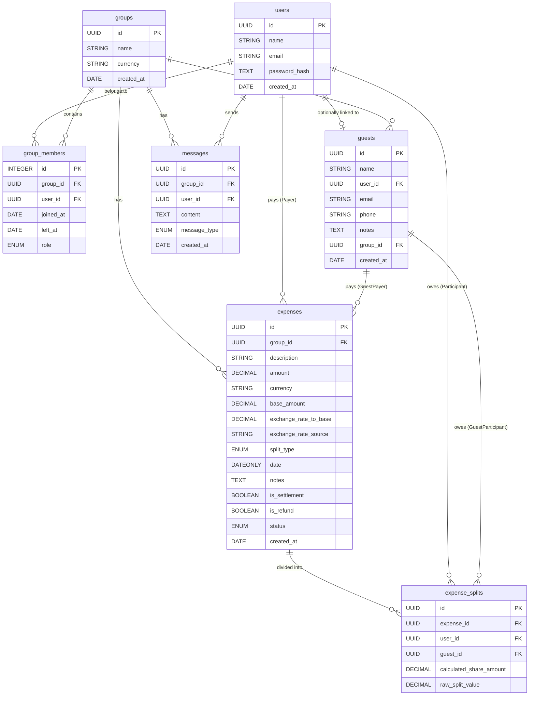

# Database Architecture & Schema Documentation

**Document Version:** 1.0.0
**Status:** Production
**Author:** Senior Backend Engineering Team
**Target Audience:** Software Architects, Backend Engineers, DBAs, Technical Interviewers

---

## 1. Database Overview

The database driving this expense-sharing application is a relational SQL database managed via Sequelize ORM. The schema is highly normalized and designed to handle complex multi-user ledger logic, including temporal group memberships, anonymous guest tracking, precision monetary splits, and direct person-to-person settlements.

### 1.1 Database Design Philosophy

1. **Absolute Ledger Integrity:** Financial transactions are immutable at the database level once committed. Complex calculations (e.g., fractional percentage splits) are completed in memory via `Big.js` and stored securely as `DECIMAL(12, 4)` types.
2. **Zero-Sum Allocation:** The sum of `ExpenseSplits.calculated_share_amount` must mathematically equal the parent `Expense.base_amount`. The database expects this constraint to be perfectly balanced by the application layer prior to transaction commit.
3. **Ghost / Guest Participants:** Real-world expenses often involve people outside the app ecosystem (e.g., a visiting relative). The `guests` table provides shadow profiles to absorb ledger debt without artificially inflating the debt of registered users.
4. **Settlements as Expenses:** Direct repayments are not modeled in a separate table. They are gracefully captured in the `expenses` table via the `is_settlement` boolean, unifying the ledger query patterns while preventing `ExpenseSplit` generation.
5. **Strict Temporal Association:** The `group_members` table maintains exact `joined_at` and `left_at` bounds to support complex pro-rata billing rules.

---

## 2. Entity Relationship Diagram (ERD)



---

## 3. Core Schema Definitions

### 3.1 `users`
**Purpose:** Represents a registered human being inside the application.
**Normalization:** Avoids duplicating auth and contact information.

| Column | Data Type | Constraints | Description |
|---|---|---|---|
| `id` | `UUID` | **PK**, Default: `UUIDV4` | Primary identifier. |
| `name` | `STRING` | Not Null, Unique | The user's display name. |
| `email` | `STRING` | Not Null, Unique | Contact and authentication. |
| `password_hash` | `TEXT` | Nullable | Optional auth hash. |
| `created_at` | `DATE` | Default: `NOW` | Timestamp of registration. |

**Relationships:**
- `1:N` to `group_members` (CASCADE delete)
- `1:N` to `expenses` as Payer (RESTRICT delete)
- `1:N` to `expense_splits` as Participant (CASCADE delete)
- `1:1` to `guests` (SET NULL)
- `1:N` to `messages` (CASCADE delete)

---

### 3.2 `groups`
**Purpose:** Represents an isolated ledger boundary (e.g., "Goa Trip 2026", "Apt 4B").
**Indexing Strategy:** Lookups are typically by ID.

| Column | Data Type | Constraints | Description |
|---|---|---|---|
| `id` | `UUID` | **PK**, Default: `UUIDV4` | Primary identifier. |
| `name` | `STRING` | Not Null | Display name of the ledger. |
| `currency` | `STRING(3)` | Not Null, Default: `INR` | The base ledger currency used to normalize foreign transactions. |
| `created_at` | `DATE` | Default: `NOW` | Timestamp of creation. |

**Relationships:**
- `1:N` to `group_members` (CASCADE delete)
- `1:N` to `expenses` (CASCADE delete)
- `1:N` to `guests` (CASCADE delete)
- `1:N` to `messages` (CASCADE delete)

---

### 3.3 `group_members`
**Purpose:** A junction table connecting Users to Groups. Crucially tracks **temporal boundaries** to accurately allocate mid-month joiners and post-exit bills.

| Column | Data Type | Constraints | Description |
|---|---|---|---|
| `id` | `INTEGER` | **PK**, Auto Increment | Primary identifier. |
| `group_id` | `UUID` | **FK** to `groups` | The group the user joined. |
| `user_id` | `UUID` | **FK** to `users` | The user joining. |
| `joined_at` | `DATE` | Not Null | Start of temporal liability. |
| `left_at` | `DATE` | Nullable | End of temporal liability. |
| `role` | `ENUM` | Not Null, Default: `member`| `admin` or `member`. |

**Indexes:** 
- `idx_group_members_timeline` (`group_id`, `user_id`, `joined_at`, `left_at`) - Highly optimized for temporal overlapping queries when building ledger snapshots.

---

### 3.4 `guests`
**Purpose:** Shadow profiles for tracking financial liability of unregistered individuals.

| Column | Data Type | Constraints | Description |
|---|---|---|---|
| `id` | `UUID` | **PK`, Default: `UUIDV4` | Primary identifier. |
| `name` | `STRING` | Not Null | Display name for the ledger. |
| `user_id` | `UUID` | **FK** to `users` | Nullable. If a guest eventually registers, their shadow profile links to their real profile. |
| `email` | `STRING` | Nullable | Optional contact. |
| `phone` | `STRING` | Nullable | Optional contact. |
| `notes` | `TEXT` | Nullable | Context for the guest. |
| `group_id` | `UUID` | **FK** to `groups` | Binds a shadow profile to a specific ledger context. |
| `created_at` | `DATE` | Default: `NOW` | Creation timestamp. |

**Cascade Rules:**
- If the associated `Group` is deleted, the `Guest` is deleted (CASCADE).
- If the linked `User` is deleted, the link is severed (SET NULL).

---

### 3.5 `expenses`
**Purpose:** The central transaction record. Stores the meta-information of an economic event.

| Column | Data Type | Constraints | Description |
|---|---|---|---|
| `id` | `UUID` | **PK**, Default: `UUIDV4` | Primary identifier. |
| `group_id` | `UUID` | **FK** to `groups` | Ledger context. |
| `description` | `STRING` | Not Null | User-provided description. |
| `amount` | `DECIMAL(12, 4)` | Not Null | Original transaction amount. |
| `currency` | `STRING(3)` | Default: `INR` | Transaction currency. |
| `base_amount` | `DECIMAL(12, 4)` | Not Null | Amount normalized into the group's base currency. |
| `exchange_rate_to_base`| `DECIMAL(10, 6)` | Nullable | FX rate at time of execution. |
| `exchange_rate_source` | `STRING` | Nullable | FX provider audit trail. |
| `split_type` | `ENUM` | Default: `equal` | `equal`, `unequal`, `percentage`, `share`. |
| `date` | `DATEONLY` | Not Null | Semantic date of the expense. |
| `notes` | `TEXT` | Nullable | Description context. |
| `is_settlement` | `BOOLEAN` | Default: `false` | If true, indicates a P2P debt repayment. |
| `is_refund` | `BOOLEAN` | Default: `false` | If true, indicates incoming money. |
| `status` | `ENUM` | Default: `active` | `active`, `pending_approval`, `rejected`. |

**Monetary Precision:** Stored as `DECIMAL(12, 4)` to securely hold outputs from `Big.js` calculations up to a hundredth of a penny, preventing fractional compounding drift in the ledger.

**Indexes:** 
- `idx_expenses_group_date` (`group_id`, `date`) - Optimized for time-series aggregation and duplicate detection during CSV imports.

**Delete Behavior (Payer restriction):**
`ON DELETE RESTRICT` for `paid_by_user_id` and `paid_by_guest_id`. You cannot delete a User if they have active expenses where they paid; the financial history must be maintained.

---

### 3.6 `expense_splits`
**Purpose:** Breaks an `Expense` down into exact liabilities. Defines *who* owes the Payer, and exactly *how much*.

| Column | Data Type | Constraints | Description |
|---|---|---|---|
| `id` | `UUID` | **PK**, Default: `UUIDV4` | Primary identifier. |
| `expense_id` | `UUID` | **FK** to `expenses` | The parent expense. |
| `user_id` | `UUID` | **FK** to `users` | Optional (if guest). |
| `guest_id` | `UUID` | **FK** to `guests` | Optional (if user). |
| `calculated_share_amount`| `DECIMAL(12, 4)` | Not Null | The strict, zero-sum enforced monetary liability in base currency. |
| `raw_split_value` | `DECIMAL(12, 4)` | Nullable | The underlying ratio/percentage (e.g. 30.0000 for 30%). |

**Indexes:** 
- `idx_splits_expense_user` (`expense_id`, `user_id`)
- `idx_splits_expense_guest` (`expense_id`, `guest_id`)

> [!NOTE]
> **Why do we store both `calculated_share_amount` and `raw_split_value`?**
> If a 3-way ratio split (1:2:3) is applied to a $60 bill, the exact monetary debts are $10, $20, and $30. If the user later edits the bill to be $120, the backend can instantly reconstruct the $20, $40, and $60 liabilities seamlessly without prompting the user to recalculate the ratios.

---

### 3.7 `messages`
**Purpose:** Group chat and system audit logging.

| Column | Data Type | Constraints | Description |
|---|---|---|---|
| `id` | `UUID` | **PK**, Default: `UUIDV4` | Primary identifier. |
| `group_id` | `UUID` | **FK** to `groups` | Ledger context. |
| `user_id` | `UUID` | **FK** to `users` | Nullable. If null, indicates a system-generated message. |
| `content` | `TEXT` | Not Null | Payload. |
| `message_type` | `ENUM` | Default: `chat` | `chat` or `system_expense`. |
| `created_at` | `DATE` | Default: `NOW` | Timestamp. |

---

## 4. Relationship Behaviors & Mechanics

### 4.1 Settlements (Expense Architecture)
Unlike systems that utilize a separate `settlements` table, this design maps settlements directly into the `expenses` table via `is_settlement = true`.
- **Why?** It ensures that generating a comprehensive timeline of cash flow is a single `SELECT * FROM expenses ORDER BY date` rather than requiring a complex, unindexed UNION across multiple tables.
- **Rules:** When `is_settlement` is true, zero `expense_splits` are generated. The `paid_by_user_id` is the debtor paying the money back, and a secondary column (handled via metadata/joins) represents the receiver.

### 4.2 Polymorphic Participant Structure
The `expense_splits` table avoids complex generic polymorphism. It explicitly contains `user_id` and `guest_id` foreign keys.
- **Rule:** Exactly one of these keys must be populated per row. This is enforced by backend logic to maintain referential integrity while allowing simple `LEFT JOIN` structures for generating balance sheets.

---

## 5. Architectural Query Examples

### 5.1 Comprehensive Ledger Balance Sheet
To calculate how much money `User A` is owed across the entire group, the system utilizes a double-entry paradigm:

```sql
-- 1. Calculate how much User A has paid on behalf of the group
SELECT SUM(base_amount) as total_paid
FROM expenses 
WHERE group_id = :groupId AND paid_by_user_id = :userId;

-- 2. Subtract how much User A owes the group for their own consumption
SELECT SUM(calculated_share_amount) as total_consumed
FROM expense_splits 
WHERE expense_id IN (SELECT id FROM expenses WHERE group_id = :groupId)
  AND user_id = :userId;
```

### 5.2 Retrieving a Foreign Currency Transaction
```sql
SELECT 
    e.date, e.description, 
    e.amount as raw_foreign_cost, 
    e.currency as foreign_currency, 
    e.base_amount as native_cost,
    (e.base_amount / e.amount) as effective_exchange_rate
FROM expenses e
WHERE e.id = 'uuid-here';
```

---

## 6. Performance & Scale Considerations

### 6.1 Avoiding the N+1 Split Query
When loading the dashboard timeline, querying expenses and eagerly loading splits via standard ORM loops causes critical N+1 degradation.
**Strategy:** The backend uses `include` payloads with Sequelize, executing a single parameterized `IN` statement:
`SELECT * FROM expense_splits WHERE expense_id IN (...)` mapped in memory.

### 6.2 Transaction Isolation (Atomic Imports)
CSV imports generate hundreds of rows simultaneously. These are processed entirely in memory and inserted using a `Managed Transaction`. 
- **Isolation Level:** Standard `READ COMMITTED` ensures that partial CSV states are never visible to dashboard queries while the import is processing.
- **Rollback Safety:** If `ExpenseSplit` #4,000 violates a DB constraint, the transaction gracefully rolls back, preventing ledger corruption.

---

## 7. Future Engineering Improvements

1. **Exchange Rate Audit Logging:** Introduce an `exchange_rate_audits` table to historically track currency rates pulled from external APIs (e.g. Fixer.io) prior to embedding them in the `expenses` table.
2. **Import History:** Create a `csv_imports` table to store metadata about executed import batches (`import_uuid`, `total_rows`, `anomalies_detected`, `user_id_executed`). This allows for an "Undo Import" functionality by batch-deleting `expenses` mapped to a specific `import_uuid`.
3. **Partitioning:** Partition the `expense_splits` table by `group_id` as the dataset scales into the millions, isolating tenant queries cleanly in memory.
