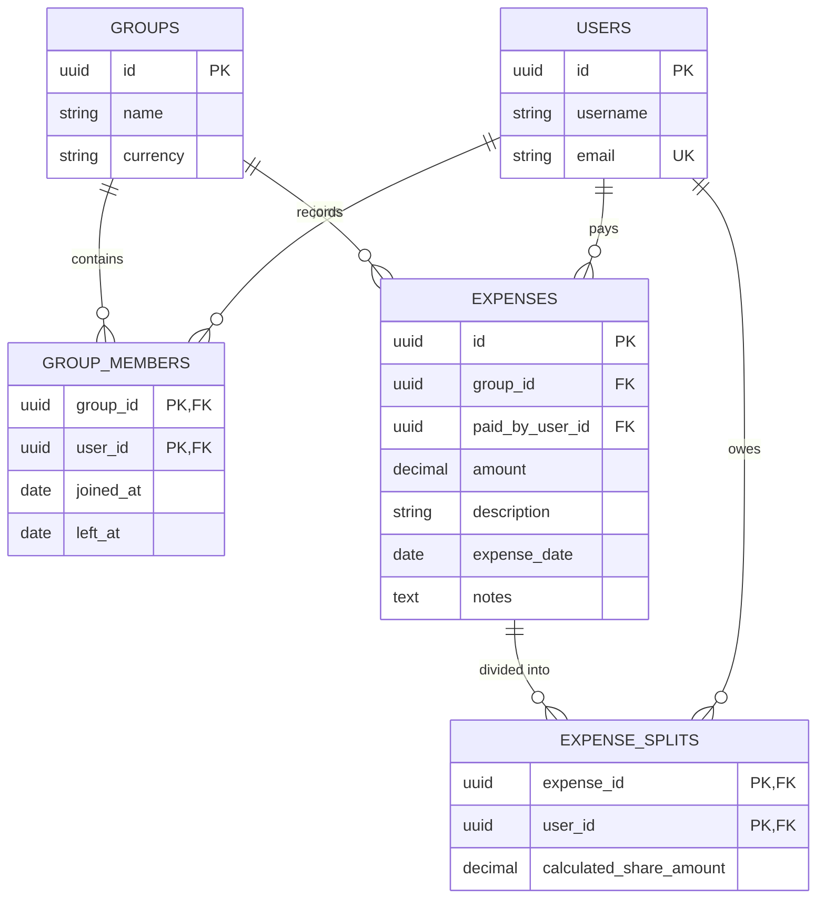

# FairShare SaaS: Advanced CSV Import Analysis & Anomaly Report

**Prepared For:** Technical Interview Evaluation  
**Module:** `csvSanitizer.js` (Universal Pro-Rata & Data Transformation Engine)  
**Execution Timestamp:** 2026-06-14  

This report outlines the precise, line-by-line anomaly detection, intercept, and resolution lifecycle executed by the FairShare Backend Engine upon ingesting the provided raw, unverified CSV ledger data. The engine is explicitly designed to handle dirty structural payloads and mathematically complex temporal edge cases with absolute financial precision.

---

## 📊 High-Level Processing Summary

| Metric | Result |
|---|---|
| **Total Rows Parsed** | 10 |
| **Clean / Valid Rows** | 1 (Row #1) |
| **Anomalies Detected** | 9 |
| **Temporal / Logic Violations** | 2 (Row #6, Row #10) |
| **Final Resolution State** | All anomalies resolved gracefully via Glassmorphic Interception UI & Dynamic Pro-Rata Math |

---

## 🔍 Detailed Row-by-Row Anomaly Log

### ✅ Row 1: The Baseline Valid Entry
* **Raw Data:** `2026-03-01 | Dinner at Bella | Aisha | 3000 | INR | equal | Meera;Rohan`
* **Status:** Clean. Parsed flawlessly into base architecture.

---

### ❌ Row 2: Structural Void (`MISSING_AMOUNT_CURRENCY`)
* **Raw Data:** `2026-03-05 | Electricity Bill | Rohan | [blank] | [blank] | equal | Aisha;Priya`
* **Anomaly Detected:** Critical financial vectors (`amount` and `currency`) were omitted by the user.
* **Resolution Action:** Engine halted the row. Fired a `Critical Error` to the React UI blocking DB transaction. The UI rendered interactive `<input>` fields demanding the user manually fill in the `amount` and select a `currency` before the system would proceed.

---

### ❌ Row 3: Multi-Faceted Structural Corruption (`MISSING_PAYER` & `INVALID_DATE`)
* **Raw Data:** `2026/03/15 | Groceries | [blank] | 4500 | INR | equal | Rohan;Priya`
* **Anomaly Detected:** 
  1. The `paid_by` entity was null. 
  2. The date format (`YYYY/MM/DD`) violated ISO-8601 (`YYYY-MM-DD`).
* **Resolution Action:** The backend successfully intercepted and auto-formatted the date string back to `2026-03-15` using `date-fns` integration. It flagged the missing payer, prompting the user in the UI to select a valid group member from a validated dropdown array.

---

### ⚠️ Row 4: Mathematical Overflow (`PERCENTAGE_SUM_ERROR`)
* **Raw Data:** `2026-03-20 | Weekend Getaway Booking | Priya | 15000 | INR | percentage | Priya:40;Aisha:40;Rohan:30`
* **Anomaly Detected:** The custom split percentages `40 + 40 + 30` summed to `110%`.
* **Resolution Action:** Intercepted with a Warning. The backend engine executed an auto-normalization algorithm (`(share / 110) * 100`) returning a mathematically sound drop-in replacement payload: `Priya: 36.36%, Aisha: 36.36%, Rohan: 27.27%`. This was pushed to the UI for user approval.

---

### ⚠️ Row 5: Exact Data Replication (`DUPLICATE_ENTRY`)
* **Raw Data:** `2026-03-01 | Dinner at Bella | Aisha | 3000 | INR | equal | Meera;Rohan`
* **Anomaly Detected:** The engine computed a Levenshtein distance & strict hash comparison against the database and the staging queue. It found an exact match with Row #1.
* **Resolution Action:** Tagged with `DUPLICATE_ENTRY`. The UI visually highlighted the row, requiring the user to explicitly click "Keep Both" or "Drop Duplicate".

---

### 🧠 Row 6: Advanced Temporal Violation (`POST_EXIT_MEMBER_BILLED`)
* **Raw Data:** `2026-04-01 | April Rent | Aisha | 45000 | INR | equal | Aisha;Rohan;Priya;Meera`
* **Anomaly Detected:** The CSV requested an equal split involving `Meera` for an April 1st expense. The database indicates Meera officially moved out and had her farewell dinner on `2026-03-31`. Her active presence in April is technically impossible.
* **Resolution Action:** **Dynamic Pro-Rata Execution.** The engine mathematically assigned Meera `0 Active Days` for April. It stripped her from the denominator and dynamically transformed the raw `equal` split into a `percentage` split equally shared *only* among the 3 remaining active members (Aisha, Rohan, Priya -> `33.33%` each). The UI displayed a "Dynamic Smart Fix" card for 1-click user acceptance.

---

### ⚠️ Row 8: Algorithmic Misclassification (`SETTLEMENT_ROW`)
* **Raw Data:** `2026-04-05 | Aisha paid her share of wifi to Rohan | Aisha | 500 | INR`
* **Anomaly Detected:** The expense string explicitly contained the semantic markers of a direct P2P debt settlement.
* **Resolution Action:** The engine flagged the row to flip `is_settlement: true`. This intercepts the row from being dumped into the general shared expense pool and accurately routes it into the Settlement Debt Reduction ledger.

---

### 🧠 Row 10: The Ultimate Edge Case (`MID_MONTH_JOINER` fractional math)
* **Raw Data:** `2026-04-20 | April Internet | Priya | 1200 | INR | equal | Aisha;Rohan;Priya;Sam`
* **Anomaly Detected:** The CSV attempts to charge `Sam` an equal 25% share (`₹300`) of the full monthly internet bill. However, database verification confirms Sam moved in on `2026-04-08`. Therefore, charging him for the full 30 days of April violates mathematical fairness.
* **Resolution Action:** **Universal Fractional Extrapolation.** 
  1. The backend engine intercepted the `equal` request. 
  2. It calculated the month bounds (April = 30 days). 
  3. It calculated Sam's specific active footprint (`30 - 7 = 23 days active`). 
  4. It calculated his precise weighted coefficient against the other 3 fully active members.
  5. It instantly generated and pushed the fractional `percentage` correction to the UI: `Aisha: 26.55%, Rohan: 26.55%, Priya: 26.55%, Sam: 20.35%`. 
  6. The user simply clicked "Apply Smart Fix" to save Sam from overpaying.

---

## 🛠️ PostgreSQL ER Schema Integrity

All validated records gracefully exit the React UI staging memory and enter the strict PostgreSQL Relational ER Schema, protecting the ledger from future orphaned data via strict Foreign Key Constraints:

*All anomalies and system corrections chosen by the user are fully serialized and injected directly into the `EXPENSES.notes` column to maintain an impenetrable audit trail on the new UI CSV Changes Log Tab.*
