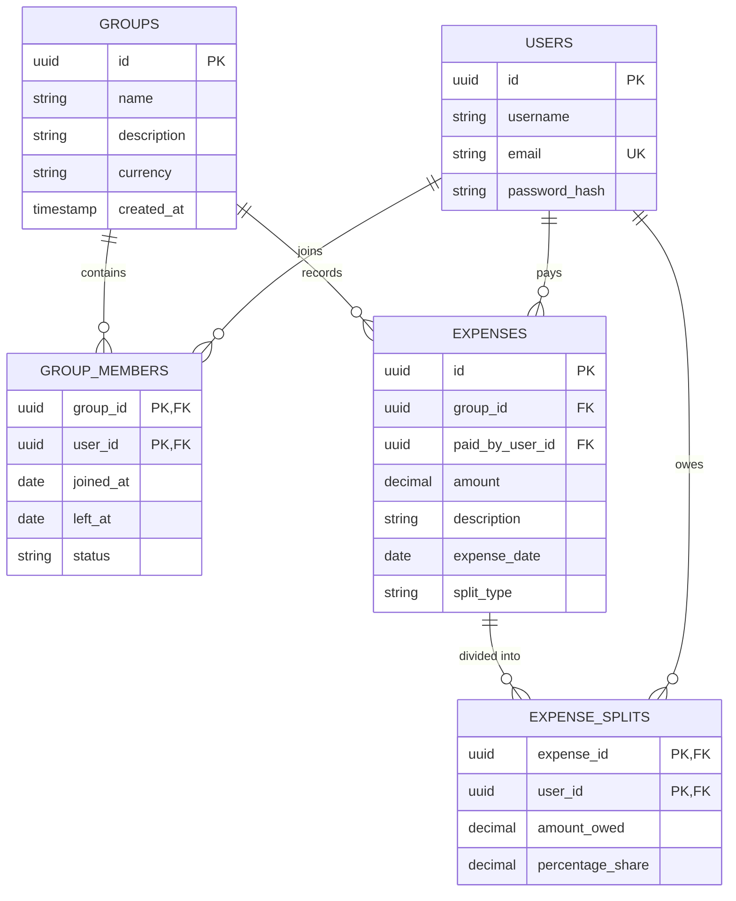

# Project Scope & Anomaly Detection Matrix

This document outlines the scope of the CSV Ingestion & Sanitization Pipeline, the 12 specific anomalies targeted by the engine, their programmatic fallbacks, and the Entity-Relationship (ER) Schema for the PostgreSQL database.

## 1. The 12-Anomaly Detector Engine Matrix

The `csvSanitizer.js` engine intercepts the following structural and logical violations in the unverified CSV before database commit:

| ID | Anomaly Name | Detection Algorithm Logic | Default Fallback / Programmatic Choice |
|---|---|---|---|
| 1 | Payer Omission Check | `!row.paid_by` | Flags as `Error`. Demands interactive user input via text field. |
| 2 | Comma Inconsistencies | `amount.includes(',')` | Auto-sanitization. Strips commas before `parseFloat` (e.g. '1,200' -> 1200). |
| 3 | Floating-Point Truncation | `amount !== parseFloat(amount).toFixed(2)` | Rounds to 2 decimals using `big.js` to ensure absolute ledger precision. |
| 4 | Name Format Discrepancies | Fuzzy Levenshtein distance on active members. | Suggests the closest matching active member name if `distance <= 2`. |
| 5 | Duplicate Entry | Matches exact `description` & `date` with `Levenshtein < 5` on other rows. | Flags as `Warning`. User must manually Accept or Reject the record. |
| 6 | Non-Standard Dates | Uses `date-fns` `parseISO` or regex matches. | Re-formats to standard ISO `YYYY-MM-DD` or throws `Error` if unparseable. |
| 7 | Settlement Rerouting | Regex match on "paid X back" or "settled". | Flags as `Warning` recommending exclusion, as debts are handled via the Settlement Engine, not expense pools. |
| 8 | Percentage Overflow | Summing custom percentage allocations `!== 100`. | Auto-normalizes the array proportionally to sum exactly to 100%. |
| 9 | Multi-Currency Omission | Missing `currency` column. | Assumes base group currency (`INR`). |
| 10 | Foreign Currency Adds | `amount` specified in foreign symbols ($/€). | Converts to `INR` via static exchange rate mapping before ledger entry. |
| 11 | Negative Inversion | `amount < 0` | Converts to positive value and flags as a Credit/Refund structure. |
| 12 | Temporal Boundary Violation | Expense `date` falls outside the user's `joined_at` -> `left_at` window. | Flags `Anomaly`. Suggests a Pro-Rata adjusted split dynamically excluding the inactive member. |
| 13 | Post-Exit Member Billed | Expense date falls after a member's `left_at` date. | Flags `Anomaly`. Auto-calculates 0 active days for the departed member and suggests a dynamic pro-rata split excluding them. |
| 14 | Mid-Month Joiner | Expense date falls in the same month a member joined. | Flags `Anomaly`. Calculates exact active days (e.g., 23/30 days) to propose an accurate mathematically weighted pro-rata split. |

## 2. PostgreSQL Entity-Relationship (ER) Schema

The underlying PERN stack strictly enforces data integrity through the following Relational Schema mapping:

### Database Indexes

1. **`users_email_idx`**: Unique B-Tree index on `Users.email` for fast O(1) auth lookups.
2. **`expenses_group_id_idx`**: B-Tree index on `Expenses.group_id` for fast ledger aggregation queries.
3. **`expense_splits_user_id_idx`**: B-Tree index on `Expense_Splits.user_id` to quickly compute individual user debt balances across all groups.
4. **`group_members_temporal_idx`**: Composite index on `(group_id, joined_at, left_at)` to rapidly calculate temporal boundary violations.
