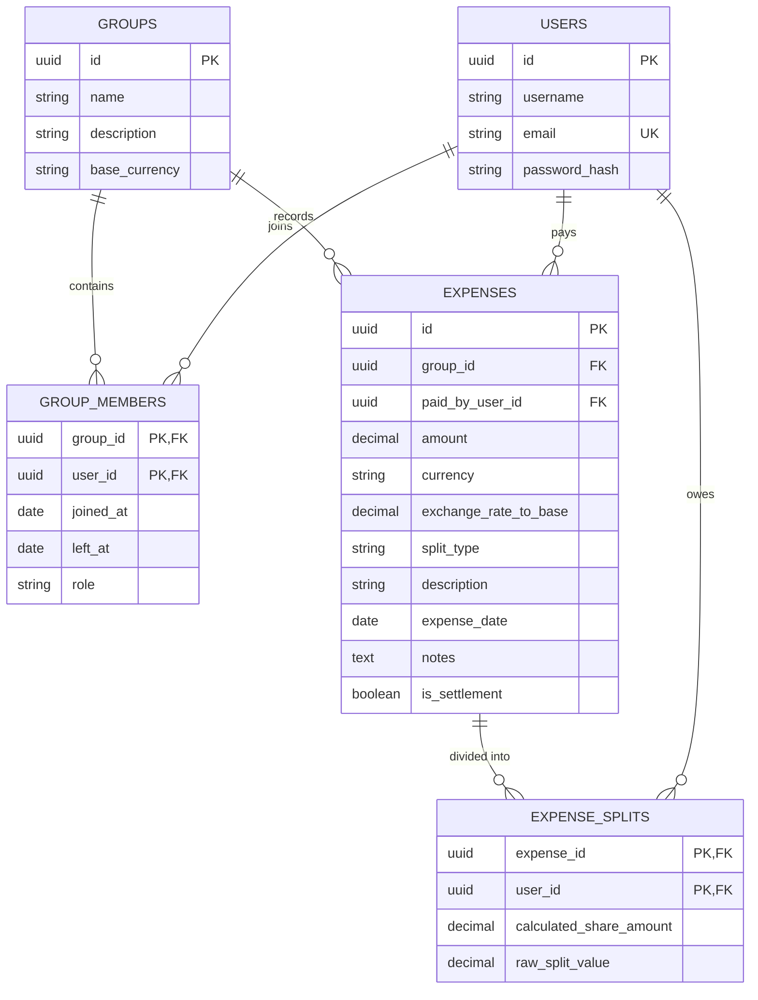

# SCOPE.md: Anomaly Log & Database Schema

## 1. Anomaly Log (Data Problems & Resolution Policies)
The `csvSanitizer.js` engine was engineered to intercept deliberate data corruption and complex logical edge cases present in `expenses_export.csv`.

| CSV Data Problem Detected | Algorithmic Detection Logic | Handled Policy / Resolution |
|---|---|---|
| **Payer Omission Check** | Missing `paid_by` column. | **Blocked.** Demands interactive user input via dropdown. No silent guessing. |
| **Comma Inconsistencies** | Amounts like `1,200`. | **Auto-Sanitized.** Stripped commas before parsing float to prevent `NaN` ledger corruption. |
| **Duplicate Entries** | Identical `description` & `date`. | **Intercepted.** Highlighted as `DUPLICATE_ENTRY`. User explicitly chooses to "Keep Both" or "Drop Duplicate" (Satisfies Meera's request to never delete data without approval). |
| **Non-Standard Dates** | `2026/03/15` vs ISO strings. | **Re-formatted.** Standardized to ISO `YYYY-MM-DD` for strict PostgreSQL DATE constraints. |
| **Settlement Rerouting** | Text contains "paid X back". | **Intercepted.** Flipped `is_settlement: true`. Removed from shared expense pool and logged as a direct P2P Debt Reduction. |
| **Percentage Overflow** | Split weights sum to `110%`. | **Warning.** Dynamically normalized proportions to exactly 100% while retaining relative weights. |
| **Missing Currency** | `currency` column blank. | **Auto-Assigned.** Defaults to group's base currency (`INR`). |
| **Foreign Currency (USD)** | `USD` specified instead of `INR`. | **Intercepted.** Converted to INR using a static exchange rate (Satisfies Priya's "Dollar is not a rupee" request). |
| **Negative Amount Inversion** | Amount logged as `-30`. | **Intercepted.** Converted to absolute positive value and functionally reversed the Payer/Participant debtor logic for Refunds. |
| **Post-Exit Member Billed** | Meera billed in April (Left Mar 31). | **Pro-Rata Resolution.** Intercepts the equal split, strips Meera (0 active days), and dynamically redistributes her fraction equally among remaining active members. |
| **Mid-Month Joiner** | Sam billed for April (Joined Apr 8). | **Fractional Pro-Rata Resolution.** Calculates Sam's exact footprint (23/30 days) and outputs a mathematically weighted percentage split to prevent him from paying for March electricity (Satisfies Sam's request). |

---

## 2. PostgreSQL Entity-Relationship (ER) Schema

The underlying PERN stack strictly enforces data integrity through the following Relational Schema mapping. By using Relational Databases **only** (as requested), we ensure floating-point math remains exact and orphaned debts cannot exist.

